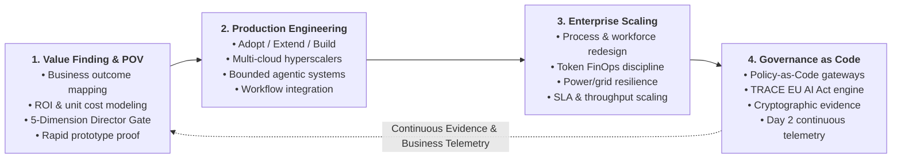

# Shibin Antony Boban
### Enterprise AI Leader | AI Director & Principal Transformation Architect

---

## 🌐 The Transformation Mandate

> *"AI has moved from an era of technology experimentation into an era of **capital discipline, operating model reinvention, and executive control**. The winners in enterprise AI will not be the organizations with the most disconnected pilots—they will be the leaders who operationalize AI as an end-to-end value driver across business processes, cloud economics, and regulatory trust."*

I lead enterprise AI transformations from the boardroom to production engineering: identifying high-value business opportunities, designing multi-hyperscaler architectures, establishing capital-disciplined operating models (FinOps), and enforcing automated governance that accelerates time-to-value in highly regulated industries.

---

## 🔄 End-to-End Value Delivery: From POV to Scaling & Governance

Transforming enterprise capability requires an integrated lifecycle where strategy, engineering, and assurance operate as a single continuous feedback loop:

---

## 🏛️ Executive Leadership & Strategic Pillars

### 1. Value Finding, Business Case & ROI Acceleration
* **The 5-Dimension Evaluation Matrix:** Screening every enterprise AI initiative across *Value, Feasibility, Risk, Adoption, and Economics* before capital allocation.
* **Approval Velocity:** Accelerating low-risk use-case approval SLAs from 10 days to 1 day through automated, tiered risk classification.
* **FinOps & Unit Economics:** Tracking fully burdened cost per outcome, token consumption efficiency, and break-even timelines to eliminate runaway inference spend.

### 2. Multi-Hyperscaler Decision Architecture
* **The Platform Heuristic:** Standardizing on **Adopt** (vendor SaaS) before **Extend** (low-code workflows), reserving **Build** (bespoke foundation models and agents) strictly for proprietary enterprise differentiation, and having the discipline to **Defer** unproven initiatives.
* **Cloud Neutrality:** Architectural fluency across Google Cloud (Vertex AI), Microsoft Azure (Foundry, Copilot Stack), AWS (Bedrock), and sovereign private stacks.

### 3. Governance as a Business Accelerator
* **Trust-Driven Enablement:** Transforming compliance from an innovation roadblock into trust infrastructure that speeds deployment.
* **TRACE Framework:** Operationalizing EU AI Act Article 50 transparency obligations into code (*Touchpoint, Role, Applicable-control, Execution, Evidence*).
* **Policy-as-Code:** Replacing subjective governance committees with deterministic runtime guardrails, bounded execution rights, and immutable audit replay ledgers.

---

## 🚀 Strategic Portfolio & Open-Source Frameworks

A curated collection of director-level frameworks, decision labs, and enterprise reference architectures:

### 📊 Enterprise Operating Models & Strategy
* [**enterprise-ai-operating-model**](https://github.com/shibinantony/enterprise-ai-operating-model)  
  *Executive AI Director operating system: quantified business cases, ROI models, platform decision heuristics (adopt/extend/build/defer), TRACE Transparency-as-Code, and Day 2 operating controls.*
* [**enterprise-ai-architecture-guide**](https://github.com/shibinantony/enterprise-ai-architecture-guide)  
  *Enterprise AI on Google Cloud: business value, architecture, Day 0–2 adoption, and operations, with Azure/AWS capability and pricing comparisons.*
* [**AIPOS-Framework**](https://github.com/shibinantony/AIPOS-Framework)  
  *AI Product Ownership System: charters, decision rights, reusable YAML specifications, and accountability checks for AI product leaders.*

### 🛡️ Responsible AI, Assurance & Governance Control Planes
* [**responsible-ai-controls-architecture**](https://github.com/shibinantony/responsible-ai-controls-architecture)  
  *Operationalizing Responsible AI from principles to Day 2 operations: consulting POV, executive 5-slide mini-deck, and client discovery checklist.*
* [**agentguard-framework**](https://github.com/shibinantony/agentguard-framework)  
  *Vendor-neutral assurance control plane for AI agents: runtime quality, safety guardrails, FinOps containment, and audit evidence.*
* [**Trust_based_Responsible_AI**](https://github.com/shibinantony/Trust_based_Responsible_AI)  
  *Rethinking enterprise scaling: why Responsible AI and governance must transition from risk avoidance to trust-based acceleration.*
* [**ai-governance-as-code**](https://github.com/shibinantony/ai-governance-as-code)  
  *Working library of Policy-as-Code and Governance-as-Code for AI in regulated BFSI and Healthcare environments.*

### 🔬 Architecture Labs & Reference Implementations
* [**AI-Hyperscaler-Playground**](https://github.com/shibinantony/AI-Hyperscaler-Playground)  
  *Executive and architect decision lab for Google Cloud, Microsoft, AWS, open AI stacks, FinOps, and multi-cloud portability.*
* [**agt-architecture-lab**](https://github.com/shibinantony/agt-architecture-lab)  
  *Independent architecture review and hands-on lab for Microsoft Agent Governance Toolkit (AGT): YAML policies, Codex/Gemini MCP, and FinOps.*
* [**sovereign_ai_ibuddy**](https://github.com/shibinantony/sovereign_ai_ibuddy)  
  *Governed private-AI pilot reference for BFSI, pharma, and sensitive industries evaluating a sovereign AI trajectory.*
* [**Governed_Agentic_RAG_PoC**](https://github.com/shibinantony/Governed_Agentic_RAG_PoC)  
  *Governed-by-design Agentic RAG PoC with bounded LangGraph loops, grounded citations, abstention policies, and hash-chained traces.*

---

## 🧭 Guiding Leadership Principles

1. **Outcomes over Algorithms:** A frontier model in isolation is a commodity. An integrated workflow delivering measurable EBITDA impact is enterprise advantage.
2. **Governance is a Seatbelt:** Governance is not designed to stop the car; it is the safety system that enables the enterprise to drive at 200 mph.
3. **Audit by Design:** If an AI decision cannot be cryptographically proven, explained, and replayed 12 months later, it is not production-ready.
4. **Day 2 is Where Value Lives:** Pre-launch approval is table stakes; continuous monitoring of drift, unit economics, and business adoption is where transformation succeeds.

---

### 🤝 Connect & Collaborate
* **LinkedIn:** [Shibin Antony Boban](https://linkedin.com/in/shibinantony)  
* **GitHub:** [@shibinantony](https://github.com/shibinantony)  
* **Advisory Topics:** Enterprise AI Strategy, Board & CXO AI Governance, Value Realization & FinOps, Multi-Hyperscaler Architecture, Agentic System Assurance.
